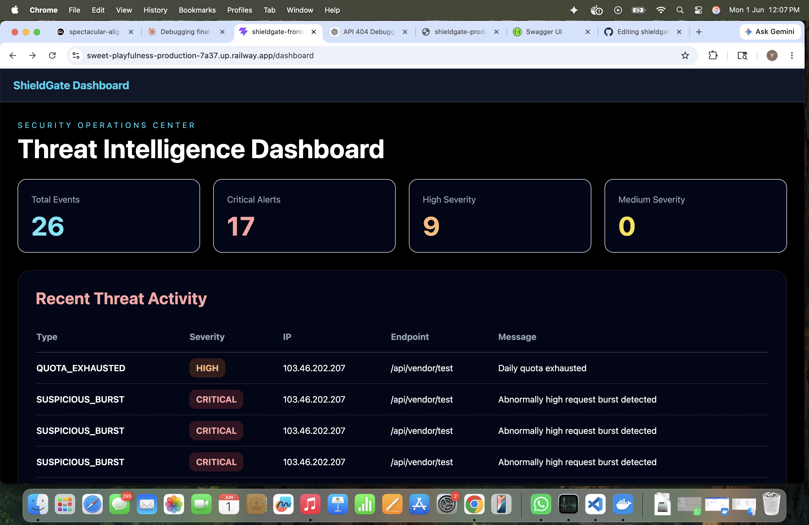
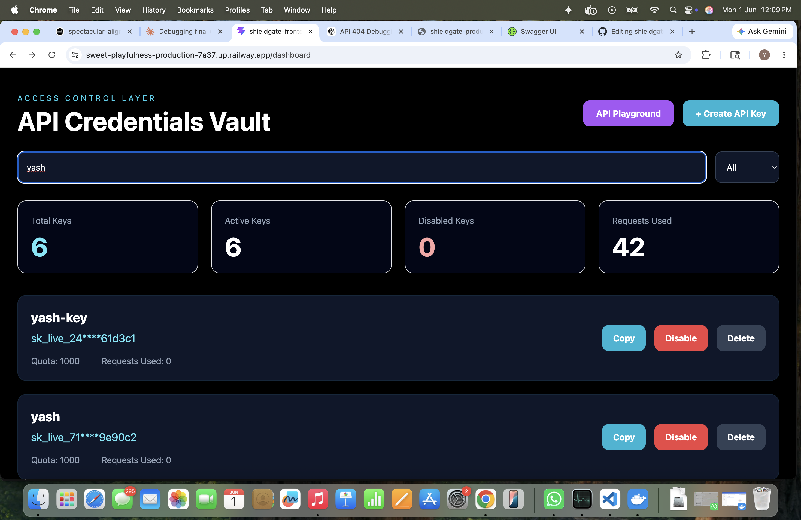
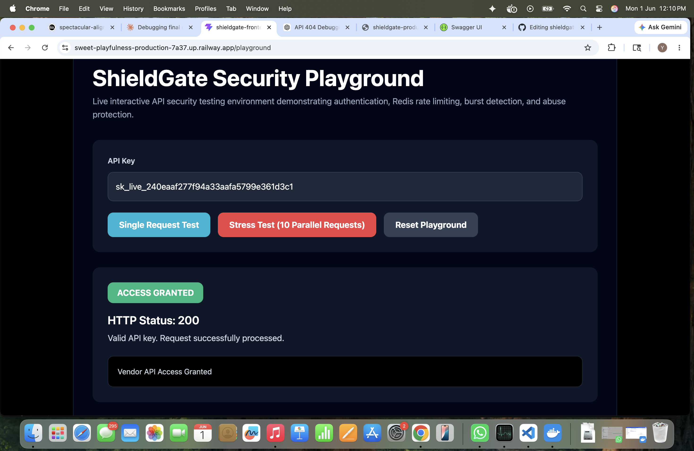
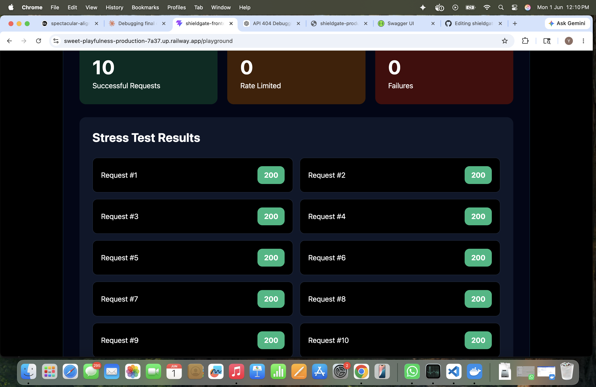
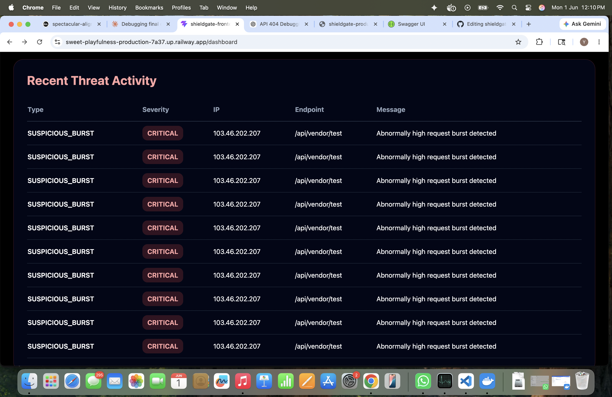
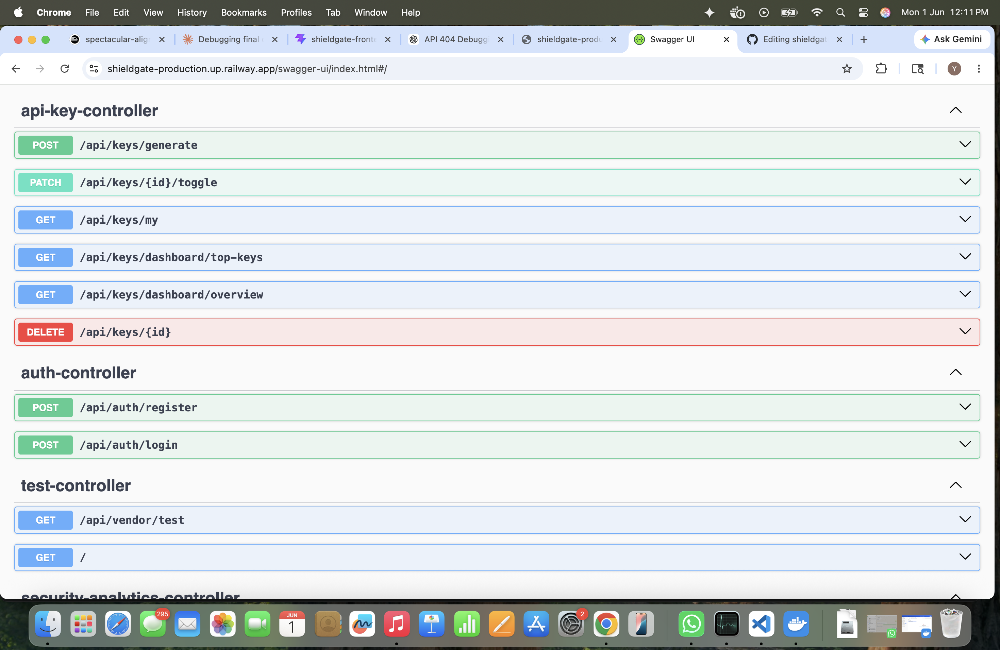

# ShieldGate 🛡️

Enterprise-grade API Security Gateway built using Spring Boot, React, MySQL, Redis, Docker, and Swagger/OpenAPI.

ShieldGate simulates real-world API protection mechanisms including API key authentication, request quota management, distributed rate limiting, burst attack detection, threat monitoring, and security analytics.

---

# Live Demo

### Frontend

https://sweet-playfulness-production-7a37.up.railway.app

### Backend API

https://shieldgate-production.up.railway.app

### Swagger Documentation

https://shieldgate-production.up.railway.app/swagger-ui/index.html

---

# Project Overview

Modern applications expose APIs that are vulnerable to:

- Unauthorized access
- Abuse and spam traffic
- Request flooding
- Quota exhaustion
- Suspicious burst attacks

ShieldGate acts as a lightweight API Security Gateway that protects backend services through layered security controls and monitoring.

---

# Features

## API Key Management

- Generate secure API keys
- Enable / disable keys
- Delete compromised keys
- Per-key quota assignment
- Usage tracking

## Authentication & Authorization

- API-key-based access control
- Invalid key rejection
- Disabled key blocking
- Protected vendor APIs

## Rate Limiting

- Redis-backed rate limiting architecture
- Request quota enforcement
- HTTP 429 protection
- Abuse prevention workflows

## Burst Attack Detection

- Detect abnormal request spikes
- Generate threat events
- Critical severity classification
- Security event persistence

## Threat Monitoring Dashboard

- Live threat feed
- Event severity tracking
- Source IP visibility
- Endpoint monitoring
- Security analytics

## Interactive API Playground

- Single request simulation
- Parallel stress testing
- Security validation testing
- Real-time API response visualization

## API Documentation

- Swagger/OpenAPI integration
- Interactive endpoint testing
- Request/response schema visualization

---

# Screenshots

## Threat Intelligence Dashboard



---

## API Key Management



---

## Successful Authentication Test



---

## Stress Test Simulation



---

## Threat Monitoring



---

## Swagger Documentation



---

# Architecture

```text
Client
   │
   ▼
React Frontend
(Dashboard + Playground)
   │
   ▼
Spring Boot API Gateway
   │
   ├── API Key Authentication
   ├── Rate Limiting Layer
   ├── Burst Detection Layer
   │
   ▼
Business Controllers
   │
   ▼
MySQL Database
```

---

# Security Request Flow

```text
Request
   │
   ▼
API Key Validation
   │
   ▼
Quota Verification
   │
   ▼
Rate Limiting Check
   │
   ▼
Burst Detection
   │
   ▼
Threat Logging
   │
   ▼
Protected Endpoint
```

---

# Tech Stack

## Backend

- Java 17
- Spring Boot
- Spring Security
- Spring Data JPA
- Maven

## Frontend

- React
- Vite
- Tailwind CSS
- JavaScript

## Database

- MySQL

## Distributed Security Layer

- Redis

## Documentation

- Swagger / OpenAPI

## Testing

- JUnit 5
- Mockito

## DevOps

- Docker
- Git
- GitHub
- Railway

---

# Testing

Automated tests cover:

- API Key Service
- API Key Controller
- Authentication Filters
- Service Layer Logic

Run tests:

```bash
./mvnw test
```

---

# Docker

Build image:

```bash
docker build -t shieldgate .
```

Run container:

```bash
docker run -p 8080:8080 shieldgate
```

---

# API Endpoints

## API Key Management

```http
POST /api/keys/create
GET /api/keys
PUT /api/keys/{id}/disable
DELETE /api/keys/{id}
```

## Protected Vendor API

```http
GET /api/vendor/test
```

## Security Monitoring

```http
GET /api/security/events
```

---

# What This Project Demonstrates

- Backend Security Engineering
- API Gateway Design
- Authentication & Authorization
- Rate Limiting Concepts
- Threat Monitoring
- Spring Security
- Database Integration
- REST API Design
- Swagger Documentation
- Automated Testing
- Docker Containerization
- Cloud Deployment
- Full-Stack Development

---

# Future Enhancements

- JWT Authentication
- RBAC (Role-Based Access Control)
- Prometheus Metrics
- Grafana Dashboards
- Kubernetes Deployment
- CI/CD Pipelines
- Multi-Tenant API Management

---

# Author

**Yash Rajput**

B.Tech Computer Science Engineering

GitHub:
https://github.com/yash06rajput
